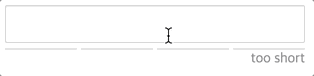

# reactjs-password-strength-bar

A React component that displays the password strength bar

[](https://nodei.co/npm/reactjs-password-strength-bar/)

[](https://www.npmjs.com/package/react-password-strength-bar)
[](https://www.npmjs.com/package/react-password-strength-bar)
[](https://coveralls.io/github/lannex/react-password-strength-bar?branch=master)
[](https://github.com/prettier/prettier)
[](https://www.npmjs.com/package/reactjs-password-strength-bar)



## Note
- Next Js Support.
- This package is based on [zxcvbn](https://github.com/dropbox/zxcvbn).
`zxcvbn` is a powerful library, but its size is very large.
- The input tag is not included.
- Actively maintained.


## Install
```
$ npm install reactjs-password-strength-bar
```
```
$ yarn add reactjs-password-strength-bar
```

## Usage
```js
import PasswordStrengthBar from 'reactjs-password-strength-bar';

const [password, setPassword] = useSate('');
<PasswordStrengthBar password={password} />
```

## Props
#### `className`: string
- isRequired: false
- default: undefined

#### `style`: object
- isRequired: false
- default: undefined

#### `scoreWordClassName`: string
- isRequired: false
- default: undefined

#### `scoreWordStyle`: object
- isRequired: false
- default: undefined

#### `password`: string
- isRequired: true
- default: ''

#### `userInputs`: string[]
- isRequired: false
- default: []

#### `barColors`: string[]
- isRequired: false
- default: ['#ddd', '#ef4836', '#f6b44d', '#2b90ef', '#25c281']

#### `scoreWords`: ReactNode[]
- isRequired: false
- default: ['weak', 'weak', 'okay', 'good', 'strong']

#### `minLength`: number
- isRequired: false
- default: 4

#### `shortScoreWord`: ReactNode
- isRequired: false
- default: 'too short'

#### `onChangeScore`: (score, feedback) => void
- isRequired: false
- default: undefined

## Browser support
Tested with modern browsers.

## License
the MIT license.
